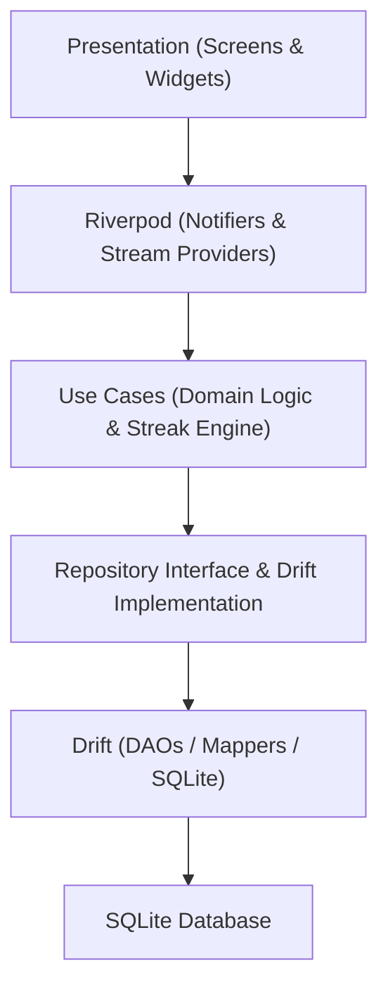

# Habit Tracker

A modern, local-first Flutter Habit Tracker application built with Clean Architecture, Riverpod, Drift SQLite, and Material 3 design system.

---

## Current Progress

- ✅ **Phase 1 Complete:** Core Infrastructure & Foundation
- ✅ **Phase 2 Complete:** Domain & Data Layer
- ✅ **Phase 3 Complete:** Habit CRUD & Management (Create Habit Vertical Slice)
- ✅ **Phase 4 Complete:** Habit Dashboard (Read Vertical Slice)
- ✅ **Phase 5 Complete:** Habit Loop & Streak Engine (`v0.3.0-alpha`)
- ✅ **Phase 6 Complete:** Habit Management (Edit, Delete, Archive) (`v0.4.0-alpha`)

---

## Key Features (v0.4.0-alpha)

- **Habit Editing Screen**: Pre-populated form (`EditHabitScreen`) for updating title, description, frequency, habit type, numeric target, target duration, color token, and icon avatar.
- **Safe Archive & Restore Workflow**: Archives active habits out of the daily dashboard feed to `ArchivedHabitsScreen` to prevent accidental log loss.
- **Archived Habits Management**: Dedicated screen (`ArchivedHabitsScreen`) for managing archived habits with 1-tap Restore and Permanent Delete confirmation dialogs.
- **Dashboard Swipe Gestures**: `Dismissible` swipe interactions on habit cards (Swipe Right to Edit, Swipe Left to Archive with SnackBar Undo).
- **Habit Loop Engine**: Atomic progress logging for Boolean, Numeric, and Timer habits backed by Drift SQLite DAOs (`HabitsDao`, `HabitLogsDao`).
- **Streak Calculation Engine**: Real-time evaluation of current streak, best streak, completion rates, and Vacation Mode protections.
- **Material 3 Progress Sheets**: `NumericProgressBottomSheet` with 4-way synced inputs and `TimerProgressBottomSheet` with Android-style countdown timer.
- **Persistent Timer Sessions**: Non-autoDispose timer providers that survive screen navigation and automatically complete.
- **Vacation Mode**: Global streak freeze protection banner and notifier.

---

## Release Checkpoints

| Version | Phase | Status |
| :--- | :--- | :--- |
| `v0.1.0-alpha` | Create Habit | Completed ✅ |
| `v0.2.0-alpha` | Dashboard | Completed ✅ |
| `v0.3.0-alpha` | Phase 5 – Habit Loop & Streak Engine | Completed ✅ |
| `v0.4.0-alpha` | Phase 6 – Habit Management (Edit, Delete, Archive) | Completed ✅ |
| `v0.5.0-beta` | Phase 7 – Notifications & Reminders | Planned |
| `v1.0.0` | First Stable Release | Planned |

---

## Architecture Diagram



---

## Getting Started

### Prerequisites
- Flutter SDK (`^3.29.0` or higher)
- Android SDK & Java JDK 17
- Dart SDK

### Installation & Run
1. Clone the repository:
   ```bash
   git clone https://github.com/Kartavvya07/Habit-Tracker.git
   ```
2. Install dependencies:
   ```bash
   flutter pub get
   ```
3. Run code generator (if updating Drift tables or models):
   ```bash
   dart run build_runner build --delete-conflicting-outputs
   ```
4. Run application:
   ```bash
   flutter run
   ```
5. Run test suite:
   ```bash
   flutter test
   ```
