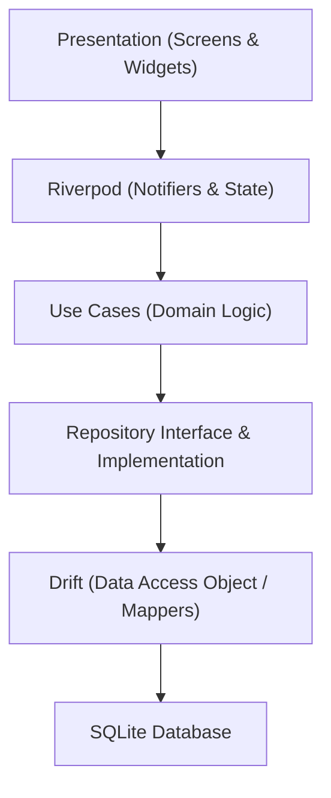

# Habit Tracker

A modern, local-first Flutter Habit Tracker application built with Clean Architecture, Riverpod, Drift SQLite, and Material 3 design system.

---

## Current Progress

- ✅ **Phase 1 Complete:** Core Infrastructure & Foundation
- ✅ **Phase 2 Complete:** Domain & Data Layer
- ✅ **Phase 3 Complete:** Habit CRUD & Management (Create Habit Vertical Slice)
- 🚧 **Phase 4 In Progress:** Habit Dashboard (Read Vertical Slice)

---

## Architecture Diagram



---

## Screenshots

| Create Habit Screen | Dashboard (Placeholder) |
| :---: | :---: |
| *(Screenshot Placeholder)* | *(Screenshot Placeholder)* |

---

## Getting Started

### Prerequisites
- Flutter SDK (`^3.29.0` or higher)
- Android SDK & Java JDK 17
- Dart SDK

### Installation & Run
1. Clone the repository:
   ```bash
   git clone https://github.com/Kartavvya07/Habit-Tracker.git
   ```
2. Install dependencies:
   ```bash
   flutter pub get
   ```
3. Run code generator (if updating Drift tables or models):
   ```bash
   dart run build_runner build --delete-conflicting-outputs
   ```
4. Run application:
   ```bash
   flutter run
   ```
5. Run test suite:
   ```bash
   flutter test
   ```
