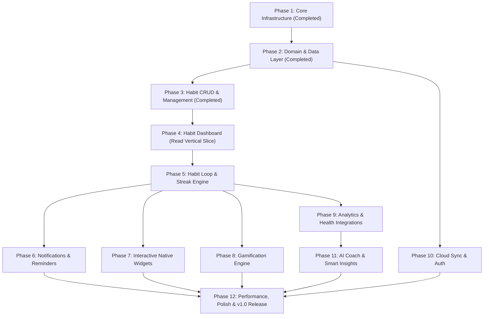

# Habit Tracker – GitHub Roadmap & Milestone Architecture

> **Document Type:** Production Project Management & Engineering Roadmap  
> **Source of Truth:** `PROJECT_SPECIFICATION_FINAL.md` & `CURRENT_PHASE.md`  
> **Status:** Phase 3 Complete | Ready for Phase 4 Execution

---

## 1. Professional Label System

| Label Name | Hex Color | Category | Description |
| :--- | :--- | :--- | :--- |
| `feature` | `#a2eeef` | Work Type | New feature implementation |
| `bug` | `#d73a4a` | Work Type | Problem or unexpected failure in existing code |
| `enhancement` | `#a2eeef` | Work Type | Improvement to an existing capability |
| `documentation` | `#0075ca` | Work Type | Improvements or additions to documentation |
| `architecture` | `#0052cc` | Domain | Clean Architecture structural decisions & abstractions |
| `database` | `#bfd4f2` | Domain | Drift SQLite schema, migrations, DTOs & query performance |
| `ui` | `#f9d0c4` | Domain | Presentation layer pages, layouts & Material Design 3 |
| `ux` | `#e99695` | Domain | Micro-animations, transitions & interactive design tokens |
| `notifications` | `#d4c5f9` | Domain | Local exact alarms, action buttons, & system triggers |
| `widgets` | `#bfdadc` | Domain | Android Glance & iOS WidgetKit native home screen widgets |
| `analytics` | `#c2e0c6` | Domain | Data visualizations, heatmaps & HealthKit/Health Connect |
| `gamification` | `#fef2c0` | Domain | Quest lines, skill trees, milestones & cosmetic unlocks |
| `sync` | `#fbca04` | Domain | Local-first cloud sync engine (PowerSync/ElectricSQL) |
| `ai` | `#bfd4f2` | Domain | AI Coach behavioral insights & habit recommendations |
| `performance` | `#c5def5` | Governance | Memory efficiency, RepaintBoundary & zero-latency target |
| `security` | `#b60205` | Governance | Encryption, secure storage & privacy compliance |
| `testing` | `#d4c5f9` | Quality | Unit, BLoC, repository & golden UI automated tests |
| `refactor` | `#1d76db` | Quality | Code improvements without behavior changes |
| `technical-debt` | `#961501` | Quality | Deferred refactoring or structural enhancements |
| `high-priority` | `#b60205` | Priority | Critical blocker for current milestone completion |
| `good-first-issue` | `#7057ff` | Onboarding | Well-scoped entry task for new contributors |

---

## 1.1 Release Checkpoints & Version Roadmap

| Version | Phase | Description | Status |
| :--- | :--- | :--- | :--- |
| `v0.1.0-alpha` | Create Habit | Habit creation form, Drift SQLite persistence & Material 3 UI | Completed ✅ |
| `v0.2.0-alpha` | Dashboard | Habit Dashboard feed, cards & live database stream | In Progress 🚧 |
| `v0.3.0-alpha` | Complete Habit | Habit completion logging, streaks & progress modal | Planned |
| `v0.4.0-alpha` | Edit/Delete | Habit edit form, archiving & deletion mechanics | Planned |
| `v0.5.0-beta` | Notifications | Local exact alarms, reminders & notification actions | Planned |
| `v1.0.0` | First Stable Release | Full release with performance, widgets, sync & store builds | Planned |

---

## 2. Milestone Hierarchy & Dependency Matrix



| Milestone | Target Horizon | Prerequisites | Core Objective |
| :--- | :--- | :--- | :--- |
| **Phase 1 – Core Infrastructure** | `COMPLETED` | None | Project setup, DI, router, theme, Drift initialization |
| **Phase 2 – Domain & Data Layer** | `COMPLETED` | Phase 1 | Immutable entities, Drift tables, repositories & mappers |
| **Phase 3 – Habit CRUD & Management** | `COMPLETED` | Phase 2 | Habit creation (Boolean, Numeric, Timer), NLP parser & templates |
| **Phase 4 – Habit Dashboard (Read Vertical Slice)** | Sprint 3 | Phase 3 | Read habit stream, M3 Dashboard UI, habit cards & stats summary |
| **Phase 5 – Habit Loop & Streak Engine** | Sprint 4 | Phase 4 | Log execution, value logging, streak calculation & Vacation Mode |
| **Phase 6 – Notifications & Reminders** | Sprint 5 | Phase 5 | Local exact alarms, BOOT_COMPLETED recovery & action buttons |
| **Phase 7 – Interactive Native Widgets** | Sprint 6 | Phase 5 | Android Glance & iOS WidgetKit home screen widgets |
| **Phase 8 – Gamification Engine** | Sprint 7 | Phase 5 | Quests, skill trees, regional milestones & cosmetic rewards |
| **Phase 9 – Analytics & Health Integrations** | Sprint 8 | Phase 5 | Heatmaps, trend graphs, Health Connect & HealthKit sync |
| **Phase 10 – Cloud Sync & Auth** | Sprint 9 | Phase 2 | Local-first delta synchronization & offline resolution |
| **Phase 11 – AI Coach & Smart Insights** | Sprint 10 | Phase 9 | Friction detection, optimal reminder timing & coaching |
| **Phase 12 – Performance, Polish & v1.0** | Sprint 11 | Phase 6–11 | Golden tests, RepaintBoundary audit & app store submission |

---

## 3. Milestone & Issue Breakdown

### Milestone 1: Phase 1 – Core Infrastructure (Completed)
**Description:** Establish project foundation, dependency injection, navigation, database initialization, theme tokens, and logging.

| Issue ID | Issue Title | Description | Acceptance Criteria | Priority | Labels | Effort |
| :--- | :--- | :--- | :--- | :--- | :--- | :---: |
| `#101` | Initialize Flutter Project & Architecture | Set up Clean Architecture feature-first folders and pubspec constraints. | Builds cleanly across platforms. | `High` | `architecture` | `S` |
| `#102` | Implement Design Tokens & M3 Theme | Create `AppColors`, `AppRadius`, `AppSpacing`, `AppTypography`, and `AppTheme`. | Themes validate M3 specs and token colors. | `High` | `ui`, `ux` | `M` |
| `#103` | Configure GoRouter & Dependency Injection | Initialize `GetIt`, `injectable`, and `GoRouter` navigation setup. | Router and DI singletons resolve error-free. | `High` | `architecture` | `M` |
| `#104` | Initialize Drift SQLite Engine & Logging | Create `AppDatabase`, platform connection, and `ProductionLogger`. | SQLite opens and BLoC observer logs lifecycle events. | `High` | `database` | `M` |

---

### Milestone 2: Phase 2 – Domain & Data Layer (Completed)
**Description:** Build the core domain entities, Drift database tables (`Habits`, `HabitLogs`), DTOs, mappers, and repository implementations.

| Issue ID | Issue Title | Description | Acceptance Criteria | Priority | Labels | Effort |
| :--- | :--- | :--- | :--- | :--- | :--- | :---: |
| `#201` | Define Core Domain Entities | Create `Habit` and `HabitLog` immutable models using `freezed`. | Enforces value types, default values & equality. | `High` | `architecture` | `M` |
| `#202` | Implement Drift Database Tables | Define `HabitsTable` and `HabitLogsTable` schemas in Drift. | Schema generates cleanly with indexes & foreign keys. | `High` | `database` | `L` |
| `#203` | Implement Data Mappers & DTOs | Write bidirectional mappers between Drift rows and Domain entities. | 100% test coverage on entity-row transformation. | `High` | `database` | `M` |
| `#204` | Implement Habit Repository | Implement `HabitRepository` interface wrapping Drift DAOs. | Reactive streams emit live updates upon database mutations. | `High` | `database`, `architecture` | `L` |
| `#205` | Repository Unit & Integration Tests | Write mock and in-memory SQLite unit tests for all repository methods. | All CRUD operations pass integration tests. | `High` | `testing`, `database` | `L` |

---

### Milestone 3: Phase 3 – Habit CRUD & Management (Completed)
**Description:** Implement habit creation, editing, deletion, categories, template picker, and NLP natural-language habit parsing.

| Issue ID | Issue Title | Description | Acceptance Criteria | Priority | Labels | Effort |
| :--- | :--- | :--- | :--- | :--- | :--- | :---: |
| `#301` | Habit Creation BLoC & Use Cases | Implement `CreateHabitUseCase`, `UpdateHabitUseCase`, `DeleteHabitUseCase`, and BLoC. | Handles state management for all habit types (Boolean, Numeric, Timer). | `High` | `architecture` | `L` |
| `#302` | Habit Creation Form UI | Build interactive habit form with color/icon picker and frequency controls. | Responsive UI conforming to Material 3 design tokens. | `High` | `ui` | `L` |
| `#303` | Habit Templates Engine | Implement pre-configured habit templates catalog (Health, Focus, Mindfulness). | One-tap instantiation of template habits into local database. | `Medium` | `feature`, `ui` | `M` |
| `#304` | NLP Habit Parsing Engine | Integrate lightweight regex/NLP parser for inputs like "Read 20 mins every morning". | Correctly extracts title, frequency, target value, and target unit. | `Medium` | `feature`, `ai` | `L` |

---

### Milestone 4: Phase 4 – Habit Dashboard (Read Vertical Slice)
**Description:** Build the main habit dashboard, list views, filter tabs, dynamic theme switching, and smooth interactive UI components.

| Issue ID | Issue Title | Description | Acceptance Criteria | Priority | Labels | Effort |
| :--- | :--- | :--- | :--- | :--- | :--- | :---: |
| `#401` | Dashboard Shell & Navigation | Implement primary bottom navigation and dashboard page layout. | One-handed navigation with sub-second page transitions. | `High` | `ui`, `ux` | `L` |
| `#402` | Today's Habit Feed BLoC & Widget | Create dynamic habit feed displaying active habits for current date. | List updates reactively when habits are completed. | `High` | `ui`, `architecture` | `L` |
| `#403` | Habit Card Interactive Component | Design habit list item with progress ring, swipe actions, and status indicators. | Smooth 60fps swipe animations with tactile haptic feedback. | `High` | `ui`, `ux` | `M` |
| `#404` | Category & Frequency Filtering | Add filter chips for category (Health, Work) and frequency views (Daily, Weekly). | Instant UI filtering without database re-queries. | `Medium` | `ui` | `M` |

---

### Milestone 5: Phase 5 – Habit Loop & Streak Engine
**Description:** Build completion execution, value logging dialogs, streak calculations, freeze mechanics, and Vacation Mode.

| Issue ID | Issue Title | Description | Acceptance Criteria | Priority | Labels | Effort |
| :--- | :--- | :--- | :--- | :--- | :--- | :---: |
| `#501` | Habit Completion Execution Logic | Implement `LogHabitProgressUseCase` for quick-tap, numeric counter, and timer habits. | Atomically records `HabitLog` entry and updates daily status. | `High` | `architecture` | `L` |
| `#502` | Streak Calculation Engine | Implement algorithm to compute current streak, best streak, and freeze protections. | Handles complex completion patterns (every N days, custom days). | `High` | `architecture`, `testing` | `L` |
| `#503` | Numeric & Timer Logging Modal | Build custom bottom sheet for entering numeric values and live timer execution. | Timer runs in background with precise tick handling. | `High` | `ui`, `ux` | `M` |
| `#504` | Vacation Mode Engine | Implement global Vacation Mode toggle to freeze streaks without penalty. | Active vacation pauses streak decay across all habits. | `Medium` | `feature` | `M` |

---

### Milestone 6: Phase 6 – Notifications & Reminder Engine
**Description:** Implement local exact alarm notifications, action buttons (Complete/Snooze), `BOOT_COMPLETED` recovery, and battery optimization onboarding.

| Issue ID | Issue Title | Description | Acceptance Criteria | Priority | Labels | Effort |
| :--- | :--- | :--- | :--- | :--- | :--- | :---: |
| `#601` | Notification Service Abstraction | Implement platform-native wrapper around `flutter_local_notifications`. | Schedules exact time notifications across Android & iOS. | `High` | `notifications` | `L` |
| `#602` | Notification Action Handlers | Add interactive action buttons ("Complete", "Snooze 15m") directly in notification payload. | Tapping notification action logs habit without launching full app. | `High` | `notifications`, `ux` | `L` |
| `#603` | Boot & Timezone Recovery Receiver | Register `BOOT_COMPLETED` broadcast receiver and timezone update listener. | Alarm schedules auto-restore upon device reboot. | `High` | `notifications`, `architecture` | `M` |
| `#604` | Battery Optimization Onboarding | Build user guidance dialog for disabling manufacturer battery restrictions. | Detects OEM ROMs (Xiaomi, Samsung) and opens settings. | `Medium` | `notifications`, `ux` | `M` |

---

### Milestone 7: Phase 7 – Interactive Native Home Screen Widgets
**Description:** Build home screen widgets using Kotlin Glance (Android) and Swift WidgetKit (iOS) supporting quick completions and heatmaps.

| Issue ID | Issue Title | Description | Acceptance Criteria | Priority | Labels | Effort |
| :--- | :--- | :--- | :--- | :--- | :--- | :---: |
| `#701` | Platform Channel Data Exporter | Expose local Drift database updates to shared App Group / SharedPreferences storage. | Native widget reads updated habit states in real-time. | `High` | `widgets`, `architecture` | `L` |
| `#702` | Android Glance Quick-Complete Widget | Create Android Glance Jetpack Compose widget with toggle checkboxes. | Completing habit on widget syncs instantly to SQLite. | `High` | `widgets` | `XL` |
| `#703` | iOS WidgetKit Interactive Widget | Create iOS WidgetKit SwiftUI interactive widget for iOS 17+. | Interactive AppIntents log habit progress cleanly. | `High` | `widgets` | `XL` |
| `#704` | Dashboard Heatmap Widget | Design medium/large widget displaying 30-day completion heatmap grid. | Renders visual completion intensity matching theme primary color. | `Medium` | `widgets`, `ui` | `L` |

---

### Milestone 8: Phase 8 – Gamification Engine
**Description:** Implement quest lines, skill trees, regional milestones, and rare cosmetic rewards.

| Issue ID | Issue Title | Description | Acceptance Criteria | Priority | Labels | Effort |
| :--- | :--- | :--- | :--- | :--- | :--- | :---: |
| `#801` | Experience & Leveling Logic | Implement XP reward engine based on consistency, streaks, and target completions. | Calculates levels, progress thresholds, and level-up events. | `Medium` | `gamification`, `architecture` | `M` |
| `#802` | Quest Lines & Challenge System | Create daily, weekly, and special event quest definitions and progress trackers. | Completing quest triggers XP gains and unlock notifications. | `Medium` | `gamification` | `L` |
| `#803` | Skill Trees & Unlocks | Build visual Skill Tree screen where users allocate points for custom icons and themes. | Unlocked nodes persist and alter app cosmetic theme tokens. | `Low` | `gamification`, `ui` | `XL` |
| `#804` | Regional Milestones & Badges | Implement achievement badges for long-term consistency milestones (e.g. 100-day streak). | Badges render with custom vector artwork and shareable cards. | `Low` | `gamification`, `ui` | `M` |

---

### Milestone 9: Phase 9 – Analytics & Health Integrations
**Description:** Build comprehensive analytics dashboard, completion heatmaps, trend graphs, and Health Connect / HealthKit bi-directional sync.

| Issue ID | Issue Title | Description | Acceptance Criteria | Priority | Labels | Effort |
| :--- | :--- | :--- | :--- | :--- | :--- | :---: |
| `#901` | Habit Analytics Engine | Implement aggregation use cases calculating completion rate, monthly distribution, and trends. | Efficient SQL grouping queries execute in <50ms. | `High` | `analytics`, `database` | `L` |
| `#902` | Interactive Heatmap Grid | Build custom GitHub-style annual/monthly habit contribution heatmap widget. | Supports tap-to-inspect daily details and smooth zooming. | `High` | `analytics`, `ui` | `L` |
| `#903` | Trend & Correlation Charts | Implement charts visualizing target vs actual metrics over week/month/year spans. | Custom animated chart components using Flutter CustomPainter. | `Medium` | `analytics`, `ui` | `L` |
| `#904` | Health Connect & HealthKit Integration | Integrate native health SDKs to automatically complete health-linked habits (e.g., steps, sleep). | Background sync pulls health metrics and marks habits done. | `Medium` | `analytics`, `feature` | `XL` |

---

### Milestone 10: Phase 10 – Cloud Sync & Authentication
**Description:** Implement local-first cloud sync engine (PowerSync / ElectricSQL), user authentication, conflict resolution, and offline queuing.

| Issue ID | Issue Title | Description | Acceptance Criteria | Priority | Labels | Effort |
| :--- | :--- | :--- | :--- | :--- | :--- | :---: |
| `#1001`| Sync Engine Implementation | Replace `NoOpSyncEngine` with production local-first synchronization worker. | Automatically streams delta changes to/from backend server. | `High` | `sync`, `architecture` | `XL` |
| `#1002`| Conflict Resolution Manager | Implement last-write-wins (LWW) and deterministic CRDT conflict resolution rules. | Resolves simultaneous multi-device offline edits seamlessly. | `High` | `sync`, `database` | `L` |
| `#1003`| Anonymous & Social Authentication | Implement Supabase/Firebase Auth supporting anonymous login and OAuth providers. | User session tokens persist securely in `FlutterSecureStorage`. | `High` | `sync`, `security` | `L` |
| `#1004`| Offline Change Queue & Retry | Build persistent mutation queue ensuring zero data loss when offline. | Retries failed network mutations with exponential backoff. | `High` | `sync` | `L` |

---

### Milestone 11: Phase 11 – AI Coach & Smart Features
**Description:** Implement non-chatbot AI Coach providing behavioral coaching, friction detection, reminder optimization, and monthly insights.

| Issue ID | Issue Title | Description | Acceptance Criteria | Priority | Labels | Effort |
| :--- | :--- | :--- | :--- | :--- | :--- | :---: |
| `#1101`| Behavioral Pattern Analyzer | Implement local rule engine detecting habit failure patterns (e.g. consistently missing Sunday evening habits). | Highlights high-friction habits in weekly summaries. | `Medium` | `ai`, `analytics` | `L` |
| `#1102`| Optimal Reminder Timing Engine | Calculate optimal notification times based on historical completion velocity. | Suggests time adjustments to maximize completion probability. | `Medium` | `ai`, `notifications` | `L` |
| `#1103`| Smart Habit Recommendation Engine | Implement contextual habit recommendation engine based on user goals. | Generates tailored habit stacks (e.g., Morning Routine stack). | `Low` | `ai` | `M` |
| `#1104`| Monthly AI Insight Cards | Generate monthly performance insight summaries highlighting progress and focus areas. | Renders interactive insight cards on dashboard UI. | `Low` | `ai`, `ui` | `M` |

---

### Milestone 12: Phase 12 – Performance, Accessibility & Production Release (v1.0)
**Description:** Complete test coverage, golden UI tests, performance profiling, accessibility compliance, and app store release preparation.

| Issue ID | Issue Title | Description | Acceptance Criteria | Priority | Labels | Effort |
| :--- | :--- | :--- | :--- | :--- | :--- | :---: |
| `#1201`| BLoC & Use Case Unit Test Suite | Write 100% unit test coverage for all BLoCs, state transitions, and domain use cases. | `flutter test --coverage` passes 100% of domain tests. | `High` | `testing` | `L` |
| `#1202`| Golden UI Test Suite | Create golden tests across light and dark themes for core screens. | Validates pixel-perfect UI rendering on multiple device sizes. | `High` | `testing`, `ui` | `L` |
| `#1203`| Performance Optimization & Profiling | Audit repaints using `RepaintBoundary`, reduce build overhead, and optimize frame times. | 60/120fps performance with zero dropped frames during scroll. | `High` | `performance` | `L` |
| `#1204`| Accessibility & Semantics Audit | Ensure full screen reader (TalkBack/VoiceOver) support and dynamic font scaling. | Passes WCAG 2.1 AA accessibility guidelines. | `Medium` | `ui`, `ux` | `M` |
| `#1205`| App Store & Play Store Release Build | Configure app signing, obfuscation (`--obfuscate`), app bundles (.aab), and store metadata. | Production builds compile cleanly for iOS App Store and Google Play. | `High` | `architecture` | `L` |

---

## 4. Git Workflow & Engineering Governance

### A. Branch Naming Convention
All branches must branch off `main` and adhere to standard prefixes:

- **Features**: `feat/<issue-id>-<short-description>` (e.g., `feat/201-habit-entities`)
- **Bug Fixes**: `fix/<issue-id>-<short-description>` (e.g., `fix/602-notification-alarm-crash`)
- **Refactoring**: `refactor/<issue-id>-<short-description>` (e.g., `refactor/401-dashboard-shell`)
- **Documentation**: `docs/<short-description>` (e.g., `docs/update-readme`)
- **Releases**: `release/v<major>.<minor>.<patch>` (e.g., `release/v1.0.0`)

### B. Commit Message Convention (Conventional Commits)
All commit messages must follow the [Conventional Commits](https://www.conventionalcommits.org/) specification:

```text
<type>(<scope>): <short description>

[optional body]

[optional footer(s)]
```

**Allowed Types:**
- `feat`: A new feature implementation
- `fix`: A bug fix
- `docs`: Documentation changes
- `style`: Formatting changes that do not affect code logic
- `refactor`: Code changes that neither fix bugs nor add features
- `perf`: Performance improvements
- `test`: Adding or correcting tests
- `chore`: Build tasks, dependency updates, or tool configurations

**Examples:**
```text
feat(domain): add immutable Habit and HabitLog freezed entities (#201)
fix(database): resolve foreign key cascade deletion in HabitLogsTable (#202)
test(theme): add unit test for Material 3 light and dark theme data (#102)
```

### C. Pull Request (PR) Formatting Standard
PR titles must follow: `<type>(<scope>): <description> [Closes #issue]`.

**PR Description Template:**
```markdown
## Summary
Brief description of changes introduced.

## Issue Reference
Closes #<issue_number>

## Type of Change
- [ ] Feature (`feat`)
- [ ] Bug Fix (`fix`)
- [ ] Refactor (`refactor`)
- [ ] Performance Optimization (`perf`)
- [ ] Documentation (`docs`)

## Verification Checklist
- [ ] `flutter analyze` passes with zero issues
- [ ] `flutter test` passes 100%
- [ ] `dart run build_runner build` succeeds cleanly
- [ ] Code follows Clean Architecture & Feature-First organization
- [ ] No placeholder implementations or TODOs added
```

### D. Release Tagging Strategy
Use Semantic Versioning (`vMAJOR.MINOR.PATCH`):
- `v1.0.0`: Production initial release
- `v1.1.0`: Minor feature additions (e.g., Gamification milestone release)
- `v1.0.1`: Patch release for critical bug fixes

### E. Milestone Completion Checklist
Before closing any milestone:
1. All child GitHub issues must be closed with passing PRs.
2. `flutter analyze` reports 0 warnings/errors.
3. `flutter test` completes with 100% pass rate.
4. `CURRENT_PHASE.md` updated to reflect next active milestone.
5. Conventional commit tag pushed for the milestone release.
