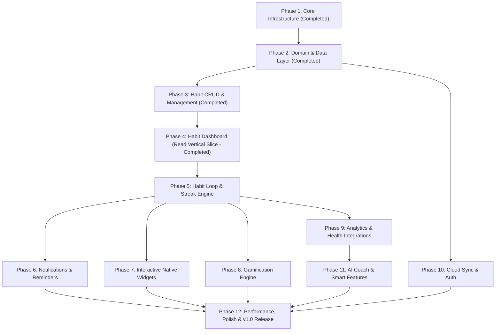

# Habit Tracker – Canonical GitHub Roadmap & Milestone Architecture

> **Document Type:** Production Project Management & Engineering Roadmap  
> **Source of Truth:** Codebase Audit & Refactored Milestone Architecture  
> **Status:** Phase 1, Phase 2, Phase 3, Phase 4 Complete | Phase 5 Pending

---

## 1. Professional Label System

| Label Name | Hex Color | Category | Description |
| :--- | :--- | :--- | :--- |
| `feature` | `#a2eeef` | Work Type | New feature implementation |
| `bug` | `#d73a4a` | Work Type | Problem or unexpected failure in existing code |
| `enhancement` | `#a2eeef` | Work Type | Improvement to an existing capability |
| `documentation` | `#0075ca` | Work Type | Improvements or additions to documentation |
| `architecture` | `#0052cc` | Domain | Clean Architecture structural decisions & abstractions |
| `database` | `#bfd4f2` | Domain | Drift SQLite schema, migrations, DTOs & query performance |
| `ui` | `#f9d0c4` | Domain | Presentation layer pages, layouts & Material Design 3 |
| `ux` | `#e99695` | Domain | Micro-animations, transitions & interactive design tokens |
| `notifications` | `#d4c5f9` | Domain | Local exact alarms, action buttons, & system triggers |
| `widgets` | `#bfdadc` | Domain | Android Glance & iOS WidgetKit native home screen widgets |
| `analytics` | `#c2e0c6` | Domain | Data visualizations, heatmaps & HealthKit/Health Connect |
| `gamification` | `#fef2c0` | Domain | Quest lines, skill trees, milestones & cosmetic unlocks |
| `sync` | `#fbca04` | Domain | Local-first cloud sync engine (PowerSync/ElectricSQL) |
| `ai` | `#bfd4f2` | Domain | AI Coach behavioral insights & habit recommendations |
| `performance` | `#c5def5` | Governance | Memory efficiency, RepaintBoundary & zero-latency target |
| `security` | `#b60205` | Governance | Encryption, secure storage & privacy compliance |
| `testing` | `#d4c5f9` | Quality | Unit, Riverpod, repository & golden UI automated tests |
| `refactor` | `#1d76db` | Quality | Code improvements without behavior changes |
| `technical-debt` | `#961501` | Quality | Deferred refactoring or structural enhancements |
| `high-priority` | `#b60205` | Priority | Critical blocker for current milestone completion |
| `good-first-issue` | `#7057ff` | Onboarding | Well-scoped entry task for new contributors |

---

## 1.1 Release Checkpoints & Version Roadmap

| Version | Phase | Description | Status |
| :--- | :--- | :--- | :--- |
| `v0.1.0-alpha` | Create Habit | Habit creation form, Drift SQLite persistence & Material 3 UI | Completed ✅ |
| `v0.2.0-alpha` | Dashboard | Habit Dashboard feed, cards & live database stream | Completed ✅ |
| `v0.3.0-alpha` | Complete Habit | Habit completion logging, streaks & progress modal | Planned |
| `v0.4.0-alpha` | Edit/Delete | Habit edit form, archiving & deletion mechanics | Planned |
| `v0.5.0-beta` | Notifications | Local exact alarms, reminders & notification actions | Planned |
| `v1.0.0` | First Stable Release | Full release with performance, widgets, sync & store builds | Planned |

---

## 2. Milestone Hierarchy & Dependency Matrix



| Milestone | Status | Prerequisites | Core Objective |
| :--- | :--- | :--- | :--- |
| **Phase 1 – Core Infrastructure** | `COMPLETED` | None | Project setup, Riverpod, GoRouter, M3 theme, Drift initialization |
| **Phase 2 – Domain & Data Layer** | `COMPLETED` | Phase 1 | Immutable entities, Drift tables, repositories & mappers |
| **Phase 3 – Habit CRUD & Management** | `COMPLETED` | Phase 2 | Habit creation form, Riverpod state, persistence & custom selectors |
| **Phase 4 – Habit Dashboard (Read Vertical Slice)** | `COMPLETED` | Phase 3 | Reactive read layer, StreamProvider, DashboardState & Dashboard UI |
| **Phase 5 – Habit Loop & Streak Engine** | `PLANNED` | Phase 4 | Habit logs table, progress logging, streak calculation & Vacation Mode |
| **Phase 6 – Notifications & Reminders** | `PLANNED` | Phase 5 | Local exact alarms, BOOT_COMPLETED recovery & action buttons |
| **Phase 7 – Interactive Native Widgets** | `PLANNED` | Phase 5 | Android Glance & iOS WidgetKit home screen widgets |
| **Phase 8 – Gamification Engine** | `PLANNED` | Phase 5 | Quests, skill trees, regional milestones & cosmetic rewards |
| **Phase 9 – Analytics & Health Integrations** | `PLANNED` | Phase 5 | Heatmaps, trend graphs, Health Connect & HealthKit sync |
| **Phase 10 – Cloud Sync & Auth** | `PLANNED` | Phase 2, 5 | Local-first delta synchronization & offline resolution |
| **Phase 11 – AI Coach & Smart Features** | `PLANNED` | Phase 9 | Friction detection, optimal reminder timing, NLP parser & insights |
| **Phase 12 – Performance, Polish & v1.0** | `PLANNED` | Phase 6–11 | Golden tests, RepaintBoundary audit & app store submission |

---

## 3. Milestone & Issue Breakdown

### Milestone 1: Phase 1 – Core Infrastructure (Completed)
**Description:** Establish project foundation, Riverpod state management setup, GoRouter navigation, database initialization, theme tokens, and logging.

| Issue ID | Issue Title | Description | Acceptance Criteria | Priority | Labels |
| :--- | :--- | :--- | :--- | :--- | :--- |
| `#101` | Initialize Flutter Project & Architecture | Set up Clean Architecture feature-first folders and pubspec constraints. | Builds cleanly across platforms. | `High` | `architecture` |
| `#102` | Implement Design Tokens & M3 Theme | Create `AppColors`, `AppRadius`, `AppSpacing`, `AppTypography`, and `AppTheme`. | Themes validate M3 specs and token colors. | `High` | `ui`, `ux` |
| `#103` | Configure GoRouter & Riverpod Setup | Initialize `GoRouter` navigation setup and `ProviderContainer` root. | Router and Riverpod providers resolve error-free. | `High` | `architecture` |
| `#104` | Initialize Drift SQLite Engine & Logging | Create `AppDatabase`, platform connection, and `appDatabaseProvider`. | SQLite opens cleanly and database provider resolves. | `High` | `database` |

---

### Milestone 2: Phase 2 – Domain & Data Layer (Completed)
**Description:** Build the core domain entities, Drift database tables (`HabitsTable`), DTOs, mappers, and repository implementations.

| Issue ID | Issue Title | Description | Acceptance Criteria | Priority | Labels |
| :--- | :--- | :--- | :--- | :--- | :--- |
| `#201` | Define Core Domain Entities | Create `Habit` immutable entity using `@freezed` and enums (`HabitColor`, `HabitFrequency`, `HabitType`). | Enforces value types, default values & equality. | `High` | `architecture` |
| `#202` | Implement Drift Database Tables | Define `HabitsTable` schema in Drift with auto-incrementing ID / UUID. | Schema generates cleanly with indexes & types. | `High` | `database` |
| `#203` | Implement Data Mappers & DTOs | Write bidirectional `HabitMapper` between Drift rows and Domain entities. | 100% test coverage on entity-row transformation. | `High` | `database` |
| `#204` | Implement Habit Repository | Implement `DriftHabitRepository` wrapping Drift queries. | Reactive streams emit live updates upon database mutations. | `High` | `database`, `architecture` |
| `#205` | Repository Unit & Integration Tests | Write mock and in-memory SQLite unit tests for repository CRUD methods. | All CRUD operations pass integration tests. | `High` | `testing`, `database` |

---

### Milestone 3: Phase 3 – Habit CRUD & Management (Create Habit Vertical Slice) (Completed)
**Description:** Implement habit creation vertical slice including domain use cases, Riverpod notifier state management, Material 3 form UI, custom color/icon selectors, and database persistence.

| Issue ID | Issue Title | Description | Acceptance Criteria | Priority | Labels |
| :--- | :--- | :--- | :--- | :--- | :--- |
| `#301` | Domain Use Cases & Riverpod State Notifier | Implement `CreateHabitUseCase`, `UpdateHabitUseCase`, `DeleteHabitUseCase`, and `CreateHabitNotifier`. | Manages validation, form state, and persistence cleanly. | `High` | `architecture` |
| `#302` | Create Habit Screen & Form Components | Build `CreateHabitScreen` with custom `ColorSelector` and `IconSelector` widgets. | Responsive UI conforming to Material 3 design tokens. | `High` | `ui` |
| `#303` | Habit Presentation Extensions | Implement UI extensions (`habit_color_extension.dart`, `habit_icon_extension.dart`) to decouple UI from domain models. | Pure domain models remain decoupled from Flutter UI imports. | `High` | `architecture`, `ui` |
| `#304` | Integration & Android Release Verification | Verify end-to-end habit creation, database persistence, unit/widget tests, and build release APK. | 100% test pass rate, 0 analyze warnings, release APK generated. | `High` | `testing`, `architecture` |

---

### Milestone 4: Phase 4 – Habit Dashboard (Read Vertical Slice) (Completed)
**Description:** Build the main habit dashboard, live database stream integration, state provider, and interactive habit feed UI.

| Issue ID | Issue Title | Description | Acceptance Criteria | Status | Priority | Labels |
| :--- | :--- | :--- | :--- | :--- | :--- | :--- |
| `#401` | Repository Reactive Read Layer | Implement `watchHabits()` in `HabitRepository` emitting `Stream<List<Habit>>` ordered by `createdAt DESC`. | Streams live updates from Drift database reactively. | `Completed` ✅ | `High` | `database` |
| `#402` | Riverpod StreamProvider Integration | Expose `habitsStreamProvider` wrapping `watchHabits()`. | Automatically updates downstream providers on DB mutations. | `Completed` ✅ | `High` | `architecture` |
| `#403` | Dashboard State Management | Design `DashboardState` sealed class (`Loading`, `Empty`, `Loaded`, `Error`) and `dashboardProvider`. | Transforms repository stream into presentation states with 100% tests. | `Completed` ✅ | `High` | `architecture` |
| `#404` | Dashboard UI & Habit Cards | Implement `DashboardScreen` UI consuming `dashboardProvider`, habit card widgets, loading/empty states, and FAB navigation. | Renders habits feed reactively with Material 3 cards and seamless FAB action. | `Completed` ✅ | `High` | `ui`, `ux` |

---

### Milestone 5: Phase 5 – Habit Loop & Streak Engine
**Description:** Build completion execution, `HabitLogsTable`, streak calculation algorithm, numeric/timer progress logging modals, and Vacation Mode.

| Issue ID | Issue Title | Description | Acceptance Criteria | Priority | Labels |
| :--- | :--- | :--- | :--- | :--- | :--- |
| `#501` | Habit Logs Table & Model | Create `HabitLogsTable` in Drift, `HabitLog` domain entity, and bidirectional `HabitLogMapper`. | Stores completion timestamp, target date, value, and status. | `High` | `database`, `architecture` |
| `#502` | Completion Execution Use Case | Implement `LogHabitProgressUseCase` for quick-tap, numeric counter, and timer habit completions. | Atomically records `HabitLog` entry and updates daily status. | `High` | `architecture` |
| `#503` | Streak Calculation Engine | Implement algorithm to compute current streak, best streak, and completion rate. | Correctly handles flexible frequency rules (daily, weekly). | `High` | `architecture`, `testing` |
| `#504` | Numeric & Timer Progress Logging Modal | Build custom bottom sheets for entering numeric values and live timer execution. | Timer runs in background with precise tick handling. | `High` | `ui`, `ux` |
| `#505` | Vacation & Streak Protection Engine | Implement global Vacation Mode toggle to freeze streaks without penalty. | Active vacation pauses streak decay across all habits. | `Medium` | `feature` |

---

### Milestone 6: Phase 6 – Notification & Reminder Engine
**Description:** Implement local exact alarm notifications, action buttons (Complete/Snooze), `BOOT_COMPLETED` recovery, and battery optimization onboarding.

| Issue ID | Issue Title | Description | Acceptance Criteria | Priority | Labels |
| :--- | :--- | :--- | :--- | :--- | :--- |
| `#601` | Notification Service Abstraction | Implement platform-native wrapper around `flutter_local_notifications`. | Schedules exact time notifications across Android & iOS. | `High` | `notifications` |
| `#602` | Notification Action Handlers | Add interactive action buttons ("Complete", "Snooze 15m") directly in notification payload. | Tapping notification action logs habit without launching full app. | `High` | `notifications`, `ux` |
| `#603` | Boot & Timezone Recovery Receiver | Register `BOOT_COMPLETED` broadcast receiver and timezone update listener. | Alarm schedules auto-restore upon device reboot. | `High` | `notifications`, `architecture` |
| `#604` | Battery Optimization Onboarding | Build user guidance dialog for disabling manufacturer battery restrictions. | Detects OEM ROMs (Xiaomi, Samsung) and opens settings. | `Medium` | `notifications`, `ux` |

---

### Milestone 7: Phase 7 – Interactive Native Home Screen Widgets
**Description:** Build home screen widgets using Kotlin Glance (Android) and Swift WidgetKit (iOS) supporting quick completions and heatmaps.

| Issue ID | Issue Title | Description | Acceptance Criteria | Priority | Labels |
| :--- | :--- | :--- | :--- | :--- | :--- |
| `#701` | Platform Channel Data Exporter | Expose local Drift database updates to shared App Group / SharedPreferences storage. | Native widget reads updated habit states in real-time. | `High` | `widgets`, `architecture` |
| `#702` | Android Glance Quick-Complete Widget | Create Android Glance Jetpack Compose widget with toggle checkboxes. | Completing habit on widget syncs instantly to SQLite. | `High` | `widgets` |
| `#703` | iOS WidgetKit Interactive Widget | Create iOS WidgetKit SwiftUI interactive widget for iOS 17+. | Interactive AppIntents log habit progress cleanly. | `High` | `widgets` |
| `#704` | Dashboard Heatmap Widget | Design medium/large widget displaying 30-day completion heatmap grid. | Renders visual completion intensity matching theme primary color. | `Medium` | `widgets`, `ui` |

---

### Milestone 8: Phase 8 – Gamification Engine
**Description:** Implement quest lines, skill trees, regional milestones, and rare cosmetic rewards.

| Issue ID | Issue Title | Description | Acceptance Criteria | Priority | Labels |
| :--- | :--- | :--- | :--- | :--- | :--- |
| `#801` | Experience & Leveling Logic | Implement XP reward engine based on consistency, streaks, and target completions. | Calculates levels, progress thresholds, and level-up events. | `Medium` | `gamification`, `architecture` |
| `#802` | Quest Lines & Challenge System | Create daily, weekly, and special event quest definitions and progress trackers. | Completing quest triggers XP gains and unlock notifications. | `Medium` | `gamification` |
| `#803` | Skill Trees & Unlocks | Build visual Skill Tree screen where users allocate points for custom icons and themes. | Unlocked nodes persist and alter app cosmetic theme tokens. | `Low` | `gamification`, `ui` |
| `#804` | Regional Milestones & Badges | Implement achievement badges for long-term consistency milestones (e.g. 100-day streak). | Badges render with custom vector artwork and shareable cards. | `Low` | `gamification`, `ui` |

---

### Milestone 9: Phase 9 – Analytics & Health Integrations
**Description:** Build comprehensive analytics dashboard, completion heatmaps, trend graphs, and Health Connect / HealthKit bi-directional sync.

| Issue ID | Issue Title | Description | Acceptance Criteria | Priority | Labels |
| :--- | :--- | :--- | :--- | :--- | :--- |
| `#901` | Habit Analytics Engine | Implement aggregation use cases calculating completion rate, monthly distribution, and trends. | Efficient SQL grouping queries execute in <50ms. | `High` | `analytics`, `database` |
| `#902` | Interactive Heatmap Grid | Build custom GitHub-style annual/monthly habit contribution heatmap widget. | Supports tap-to-inspect daily details and smooth zooming. | `High` | `analytics`, `ui` |
| `#903` | Trend & Correlation Charts | Implement charts visualizing target vs actual metrics over week/month/year spans. | Custom animated chart components using Flutter CustomPainter. | `Medium` | `analytics`, `ui` |
| `#904` | Health Connect & HealthKit Integration | Integrate native health SDKs to automatically complete health-linked habits (e.g., steps, sleep). | Background sync pulls health metrics and marks habits done. | `Medium` | `analytics`, `feature` |

---

### Milestone 10: Phase 10 – Cloud Sync & Authentication
**Description:** Implement local-first cloud sync engine (PowerSync / ElectricSQL), user authentication, conflict resolution, and offline queuing.

| Issue ID | Issue Title | Description | Acceptance Criteria | Priority | Labels |
| :--- | :--- | :--- | :--- | :--- | :--- |
| `#1001`| Sync Engine Implementation | Replace `NoOpSyncEngine` with production local-first synchronization worker. | Automatically streams delta changes to/from backend server. | `High` | `sync`, `architecture` |
| `#1002`| Conflict Resolution Manager | Implement last-write-wins (LWW) and deterministic CRDT conflict resolution rules. | Resolves simultaneous multi-device offline edits seamlessly. | `High` | `sync`, `database` |
| `#1003`| Anonymous & Social Authentication | Implement Supabase/Firebase Auth supporting anonymous login and OAuth providers. | User session tokens persist securely in `FlutterSecureStorage`. | `High` | `sync`, `security` |
| `#1004`| Offline Change Queue & Retry | Build persistent mutation queue ensuring zero data loss when offline. | Retries failed network mutations with exponential backoff. | `High` | `sync` |

---

### Milestone 11: Phase 11 – AI Coach & Smart Features
**Description:** Implement non-chatbot AI Coach providing behavioral coaching, friction detection, reminder optimization, NLP habit creation, and monthly insights.

| Issue ID | Issue Title | Description | Acceptance Criteria | Priority | Labels |
| :--- | :--- | :--- | :--- | :--- | :--- |
| `#1101`| Behavioral Pattern Analyzer | Implement local rule engine detecting habit failure patterns. | Highlights high-friction habits in weekly summaries. | `Medium` | `ai`, `analytics` |
| `#1102`| Optimal Reminder Timing Engine | Calculate optimal notification times based on historical completion velocity. | Suggests time adjustments to maximize completion probability. | `Medium` | `ai`, `notifications` |
| `#1103`| Natural Language Processing (NLP) Parser | Integrate regex/NLP parser for inputs like "Read 20 mins every morning". | Extracts title, frequency, target value, and target unit. | `Low` | `ai`, `feature` |
| `#1104`| Monthly AI Performance Insight Cards | Generate monthly performance insight summaries highlighting progress and focus areas. | Renders interactive insight cards on dashboard UI. | `Low` | `ai`, `ui` |

---

### Milestone 12: Phase 12 – Performance, Accessibility & Production Release (v1.0)
**Description:** Complete test coverage, golden UI tests, performance profiling, accessibility compliance, and app store release preparation.

| Issue ID | Issue Title | Description | Acceptance Criteria | Priority | Labels |
| :--- | :--- | :--- | :--- | :--- | :--- |
| `#1201`| Unit & Provider Test Suite Verification | Write 100% unit test coverage for all domain use cases and Riverpod providers. | `flutter test --coverage` passes 100% of domain and state tests. | `High` | `testing` |
| `#1202`| Golden UI Test Suite | Create golden tests across light and dark themes for core screens. | Validates pixel-perfect UI rendering on multiple device sizes. | `High` | `testing`, `ui` |
| `#1203`| Performance Optimization & Profiling | Audit repaints using `RepaintBoundary`, reduce build overhead, and optimize frame times. | 60/120fps performance with zero dropped frames during scroll. | `High` | `performance` |
| `#1204`| Accessibility & Semantics Audit | Ensure full screen reader (TalkBack/VoiceOver) support and dynamic font scaling. | Passes WCAG 2.1 AA accessibility guidelines. | `Medium` | `ui`, `ux` |
| `#1205`| App Store & Play Store Release Build | Configure app signing, obfuscation (`--obfuscate`), app bundles (.aab), and store metadata. | Production builds compile cleanly for iOS App Store and Google Play. | `High` | `architecture` |

---

## 4. Git Workflow & Engineering Governance

### A. Branch Naming Convention
All branches branch off `main` and adhere to standard prefixes:
- **Features**: `feat/<issue-id>-<short-description>` (e.g., `feat/404-dashboard-ui`)
- **Bug Fixes**: `fix/<issue-id>-<short-description>` (e.g., `fix/602-notification-alarm-crash`)
- **Refactoring**: `refactor/<issue-id>-<short-description>` (e.g., `refactor/401-dashboard-shell`)
- **Documentation**: `docs/<short-description>` (e.g., `docs/update-readme`)
- **Releases**: `release/v<major>.<minor>.<patch>` (e.g., `release/v1.0.0`)

### B. Commit Message Convention (Conventional Commits)
All commit messages must follow the [Conventional Commits](https://www.conventionalcommits.org/) specification:

```text
<type>(<scope>): <short description>
```

**Allowed Types:** `feat`, `fix`, `docs`, `style`, `refactor`, `perf`, `test`, `chore`.

### C. Milestone Completion Checklist
Before closing any milestone:
1. All child GitHub issues must be closed with passing PRs.
2. `flutter analyze` reports 0 warnings/errors.
3. `flutter test` completes with 100% pass rate.
4. `CURRENT_PHASE.md` updated to reflect next active milestone.
