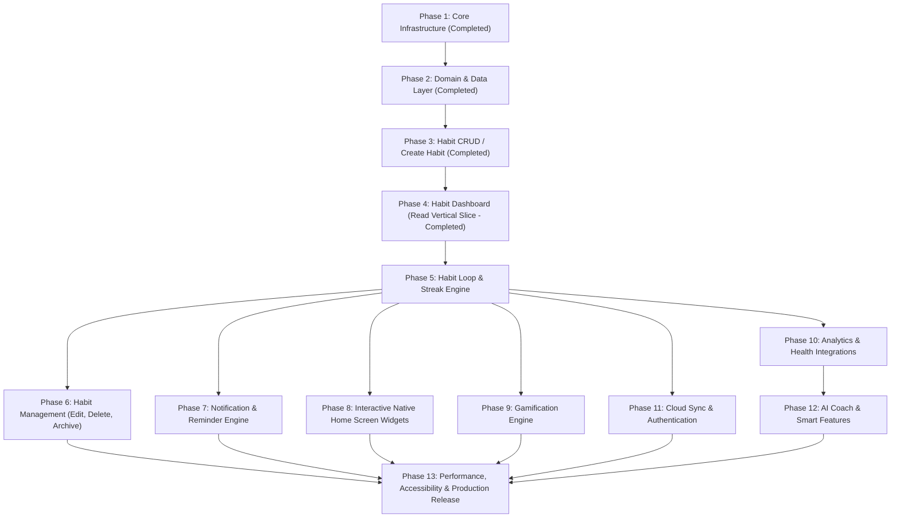

# Habit Tracker – Canonical GitHub Roadmap & Engineering Governance

> **Document Type:** Production Project Management & Engineering Roadmap  
> **Source of Truth:** Codebase Audit & Refactored Milestone Architecture  
> **Status:** Phase 1–4 Completed (Historical Record) | Phase 5–13 Active Refactored Roadmap

---

## 1. Professional Label System (Unified Taxonomy)

| Label Name | Hex Color | Category | Description |
| :--- | :--- | :--- | :--- |
| `feature` | `#a2eeef` | Work Type | New feature implementation |
| `bug` | `#d73a4a` | Work Type | Problem or unexpected failure in existing code |
| `enhancement` | `#a2eeef` | Work Type | Improvement to an existing capability |
| `documentation` | `#0075ca` | Work Type | Improvements or additions to documentation |
| `architecture` | `#0052cc` | Domain | Clean Architecture structural decisions & abstractions |
| `database` | `#bfd4f2` | Domain | Drift SQLite schema, migrations, DTOs & query performance |
| `domain` | `#0e8a16` | Domain | Immutable domain entities, value objects & pure use cases |
| `repository` | `#1d76db` | Domain | Repository interfaces & Drift data access implementations |
| `usecase` | `#5319e7` | Domain | Business logic use cases executing core application rules |
| `riverpod` | `#fbca04` | Domain | Riverpod state providers, stream providers & state notifiers |
| `ui` | `#f9d0c4` | Domain | Presentation layer pages, layouts & Material Design 3 |
| `ux` | `#e99695` | Domain | Micro-animations, transitions & interactive design tokens |
| `notifications` | `#d4c5f9` | Domain | Local exact alarms, action buttons & system triggers |
| `widgets` | `#bfdadc` | Domain | Android Glance & iOS WidgetKit native home screen widgets |
| `analytics` | `#c2e0c6` | Domain | Data visualizations, heatmaps & HealthKit/Health Connect |
| `gamification` | `#fef2c0` | Domain | Quest lines, skill trees, milestones & cosmetic unlocks |
| `sync` | `#fbca04` | Domain | Local-first cloud sync engine (PowerSync/ElectricSQL) |
| `ai` | `#bfd4f2` | Domain | AI Coach behavioral insights & habit recommendations |
| `performance` | `#c5def5` | Governance | Memory efficiency, RepaintBoundary & zero-latency target |
| `security` | `#b60205` | Governance | Encryption, secure storage & privacy compliance |
| `accessibility` | `#d4c5f9` | Governance | WCAG 2.1 AA compliance, semantics, screen readers & touch targets |
| `native` | `#0052cc` | Platform | Native Kotlin Glance & Swift WidgetKit integrations |
| `release` | `#0075ca` | Governance | Milestone release verification, git tag & APK bundle build |
| `testing` | `#d4c5f9` | Quality | Unit, Riverpod, repository & golden UI automated tests |
| `refactor` | `#1d76db` | Quality | Code improvements without behavior changes |
| `technical-debt` | `#961501` | Quality | Deferred refactoring or structural enhancements |
| `high-priority` | `#b60205` | Priority | Critical blocker for current milestone completion |
| `good-first-issue` | `#7057ff` | Onboarding | Well-scoped entry task for new contributors |

---

## 1.1 Release Checkpoints & Version Roadmap

| Version | Phase | Description | Status |
| :--- | :--- | :--- | :--- |
| `v0.1.0-alpha` | Create Habit | Habit creation form, Drift SQLite persistence & Material 3 UI | Completed ✅ |
| `v0.2.0-alpha` | Dashboard | Habit Dashboard feed, cards & live database stream | Completed ✅ |
| `v0.3.0-alpha` | Phase 5 – Habit Loop | Completion logging, streaks, logging modals & Vacation Mode | Planned |
| `v0.4.0-alpha` | Phase 6 – Habit Management | Habit editing, archiving, deletion mechanics & swipe actions | Planned |
| `v0.5.0-beta` | Phase 7 – Notifications | Local exact alarms, action buttons, BOOT_COMPLETED recovery | Planned |
| `v0.6.0-beta` | Phase 8 – Home Widgets | Android Glance & iOS WidgetKit home screen widgets | Planned |
| `v0.7.0-beta` | Phase 9 – Gamification | XP rewards, leveling, quest lines, skill trees & badges | Planned |
| `v0.8.0-beta` | Phase 10 – Analytics & Health | Contribution heatmaps, trend graphs, Health Connect & HealthKit | Planned |
| `v0.9.0-beta` | Phase 11 – Cloud Sync | Local-first delta sync engine, authentication & CRDT resolution | Planned |
| `v0.9.5-beta` | Phase 12 – AI Coach | Behavioral friction analysis, reminder timing, NLP parser | Planned |
| `v1.0.0` | Phase 13 – Production Release | Golden tests, 100% provider tests, performance audit & store builds | Planned |

---

## 2. Milestone Hierarchy & Dependency Matrix

| Milestone | Status | Prerequisites | Core Objective |
| :--- | :--- | :--- | :--- |
| **Phase 1 – Core Infrastructure** | `COMPLETED` | None | Project setup, Riverpod, GoRouter, M3 theme, Drift initialization |
| **Phase 2 – Domain & Data Layer** | `COMPLETED` | Phase 1 | Immutable entities, Drift tables, repositories & mappers |
| **Phase 3 – Habit CRUD (Create)** | `COMPLETED` | Phase 2 | Habit creation form, Riverpod state, persistence & selectors |
| **Phase 4 – Habit Dashboard** | `COMPLETED` | Phase 3 | Reactive read layer, StreamProvider, DashboardState & UI |
| **Phase 5 – Habit Loop & Streak Engine** | `PLANNED` | Phase 4 | HabitLogs table, progress logging, streaks & Vacation Mode |
| **Phase 6 – Habit Management** | `PLANNED` | Phase 5 | Edit form, archiving mechanics, deletion & swipe actions |
| **Phase 7 – Notifications & Reminders** | `PLANNED` | Phase 5 | Local exact alarms, BOOT_COMPLETED recovery & action buttons |
| **Phase 8 – Native Widgets** | `PLANNED` | Phase 5 | Android Glance & iOS WidgetKit interactive widgets |
| **Phase 9 – Gamification Engine** | `PLANNED` | Phase 5 | XP, leveling, quest lines, skill trees & milestone badges |
| **Phase 10 – Analytics & Health** | `PLANNED` | Phase 5 | Heatmaps, trend graphs, Health Connect & HealthKit sync |
| **Phase 11 – Cloud Sync & Auth** | `PLANNED` | Phase 5 | Local-first delta synchronization, auth & CRDT resolution |
| **Phase 12 – AI Coach & Smart Features** | `PLANNED` | Phase 10 | Behavioral friction detection, timing optimization & NLP parser |
| **Phase 13 – Performance, Polish & v1.0** | `PLANNED` | Phase 6–12 | Golden tests, 100% provider coverage, WCAG & app store builds |

---

## 3. Milestone & Issue Breakdown

### Milestone 1: Phase 1 – Core Infrastructure (Completed ✅)
*Historical record preserved.*

### Milestone 2: Phase 2 – Domain & Data Layer (Completed ✅)
*Historical record preserved.*

### Milestone 3: Phase 3 – Habit CRUD (Create Habit Vertical Slice) (Completed ✅)
*Historical record preserved.*

### Milestone 4: Phase 4 – Habit Dashboard (Read Vertical Slice) (Completed ✅)
*Historical record preserved.*

---

### Milestone 5: Phase 5 – Habit Loop & Streak Engine (`v0.3.0-alpha`)
**Description:** Build completion execution, `HabitLogsTable`, streak calculation algorithm, numeric/timer progress logging modals, Vacation Mode, widget tests, and release `v0.3.0-alpha`.

#### P5-01 Habit Log Schema & Drift Migration
- **Purpose:** Define database schema for recording habit execution entries.
- **Scope:** Create `HabitLogsTable` in Drift, `HabitLog` domain entity using `@freezed`, and bidirectional `HabitLogMapper`.
- **Files likely to change:** `lib/core/database/tables/habit_logs_table.dart`, `lib/features/habits/domain/entities/habit_log.dart`, `lib/features/habits/data/mappers/habit_log_mapper.dart`, `lib/core/database/app_database.dart`
- **Dependencies:** Phase 4 completed
- **Acceptance Criteria:** `HabitLogsTable` compiles cleanly, auto-generates schema via `build_runner`, and supports index on `(habit_id, target_date)`.
- **Testing Requirements:** Unit test `HabitLogMapper` bidirectional conversion with 100% code coverage.
- **Completion Criteria:** Code compiles, tests pass, zero analyze warnings.
- **Required Labels:** `database`, `architecture`
- **Priority:** High
- **Suggested commit message:** `feat(database): add HabitLogsTable schema and HabitLog domain mapper`

#### P5-02 Habit Log Repository Integration
- **Purpose:** Extend habit repository to perform atomic completion logging and log queries.
- **Scope:** Add `logProgress()`, `getLogsForHabit()`, `watchTodayLogs()`, and `deleteLog()` to `HabitRepository` and `DriftHabitRepository`.
- **Files likely to change:** `lib/features/habits/domain/repositories/habit_repository.dart`, `lib/features/habits/data/repositories/drift_habit_repository.dart`
- **Dependencies:** P5-01
- **Acceptance Criteria:** Log operations update database reactively and emit updated log streams.
- **Testing Requirements:** Repository integration tests with in-memory SQLite for all log query methods.
- **Completion Criteria:** All repository log methods pass automated unit/integration tests.
- **Required Labels:** `repository`, `database`
- **Priority:** High
- **Suggested commit message:** `feat(data): implement habit log persistence and reactive streams in DriftHabitRepository`

#### P5-03 Habit Log & Streak Use Cases
- **Purpose:** Implement domain logic for logging progress and computing streaks.
- **Scope:** Implement `LogHabitProgressUseCase` (supports boolean, numeric counter, and timer habits) and `CalculateStreakUseCase` (computes current streak, best streak, completion rate).
- **Files likely to change:** `lib/features/habits/domain/usecases/log_habit_progress_use_case.dart`, `lib/features/habits/domain/usecases/calculate_streak_use_case.dart`
- **Dependencies:** P5-02
- **Acceptance Criteria:** Correctly calculates streaks respecting custom frequencies (daily, specific days) and handles missing days accurately.
- **Testing Requirements:** Unit test streak calculation algorithm against 15+ edge cases (gaps, leap years, weekend habits).
- **Completion Criteria:** 100% test coverage on `CalculateStreakUseCase` and `LogHabitProgressUseCase`.
- **Required Labels:** `usecase`, `domain`
- **Priority:** High
- **Suggested commit message:** `feat(domain): implement LogHabitProgressUseCase and CalculateStreakUseCase`

#### P5-04 Daily Completion & Streak Riverpod Providers
- **Purpose:** Expose habit completion logs and streak calculations to presentation layer via Riverpod.
- **Scope:** Create `todayCompletionsProvider`, `habitLogsStreamProvider`, and `streakProvider`.
- **Files likely to change:** `lib/features/habits/presentation/providers/habit_completion_provider.dart`, `lib/features/habits/presentation/providers/streak_provider.dart`
- **Dependencies:** P5-03
- **Acceptance Criteria:** Providers recompute reactively whenever a habit log entry is added or removed.
- **Testing Requirements:** Provider unit tests using `ProviderContainer` verifying state emissions upon repository triggers.
- **Completion Criteria:** State providers compile and update reactively without UI coupling.
- **Required Labels:** `riverpod`, `architecture`
- **Priority:** High
- **Suggested commit message:** `feat(architecture): expose completion and streak state via Riverpod providers`

#### P5-05 Numeric & Timer Progress Logging Modals
- **Purpose:** Build custom bottom sheets for entering numeric progress values and running live habit timers.
- **Scope:** Build `NumericProgressBottomSheet` (number keypad / stepper) and `TimerProgressBottomSheet` (stopwatch with start/pause/submit).
- **Files likely to change:** `lib/features/habits/presentation/widgets/numeric_progress_bottom_sheet.dart`, `lib/features/habits/presentation/widgets/timer_progress_bottom_sheet.dart`
- **Dependencies:** P5-04
- **Acceptance Criteria:** Tapping numeric or timer habit opens bottom sheet, accepts user input, and logs completed progress value.
- **Testing Requirements:** Widget tests for both bottom sheet components verifying input handling and submit callbacks.
- **Completion Criteria:** Modals render cleanly with M3 styling and correctly log partial/full progress.
- **Required Labels:** `ui`, `ux`
- **Priority:** High
- **Suggested commit message:** `feat(ui): build numeric stepper and timer progress logging bottom sheets`

#### P5-06 Boolean Quick Completion Toggle UI
- **Purpose:** Add one-tap habit completion toggle directly onto `HabitCard` on Dashboard.
- **Scope:** Add completion button/checkbox on `HabitCard` with optimistic state update, haptic feedback, and completed visual state.
- **Files likely to change:** `lib/features/dashboard/presentation/widgets/habit_card.dart`, `lib/features/dashboard/presentation/screens/dashboard_screen.dart`
- **Dependencies:** P5-05
- **Acceptance Criteria:** Tapping completion toggle instantly updates UI state and persists log to database without frame drop.
- **Testing Requirements:** Widget test verifying tap action triggers `LogHabitProgressUseCase` and updates card visuals.
- **Completion Criteria:** Interactive toggle works seamlessly with 60fps responsiveness.
- **Required Labels:** `ui`, `ux`
- **Priority:** High
- **Suggested commit message:** `feat(ui): add interactive completion toggle to HabitCard`

#### P5-07 Vacation Mode & Streak Protection Engine
- **Purpose:** Allow users to pause streaks globally during travel or illness without losing hard-earned streaks.
- **Scope:** Create `VacationModeNotifier`, `vacationModeProvider`, and streak protection evaluation logic in `CalculateStreakUseCase`.
- **Files likely to change:** `lib/features/habits/domain/usecases/calculate_streak_use_case.dart`, `lib/features/settings/presentation/providers/vacation_mode_provider.dart`
- **Dependencies:** P5-03
- **Acceptance Criteria:** When Vacation Mode is active, missed days do not break existing streaks.
- **Testing Requirements:** Unit test streak calculator with active vacation mode periods.
- **Completion Criteria:** Vacation mode toggle correctly freezes streak decay.
- **Required Labels:** `domain`, `feature`
- **Priority:** Medium
- **Suggested commit message:** `feat(feature): implement Vacation Mode and streak protection logic`

#### P5-08 Dashboard Integration & Streak Badges
- **Purpose:** Integrate streak counter badges and progress bars into DashboardScreen.
- **Scope:** Display current streak flame badge and target value progress indicators on `HabitCard` and header summary.
- **Files likely to change:** `lib/features/dashboard/presentation/widgets/habit_card.dart`, `lib/features/dashboard/presentation/screens/dashboard_screen.dart`
- **Dependencies:** P5-06
- **Acceptance Criteria:** Renders active streak count on cards and displays total daily completion progress ring.
- **Testing Requirements:** Widget tests verifying streak count and progress bar reflect provider state accurately.
- **Completion Criteria:** Dashboard visually displays streaks and progress stats cleanly.
- **Required Labels:** `ui`, `ux`
- **Priority:** High
- **Suggested commit message:** `feat(ui): render streak badges and completion progress on Dashboard`

#### P5-09 Habit Loop & Streak Unit & Widget Tests
- **Purpose:** Verify reliability of complete habit loop and streak engine.
- **Scope:** Write unit tests for all use cases, mappers, providers, and widget tests for logging UI.
- **Files likely to change:** `test/features/habits/domain/usecases/calculate_streak_use_case_test.dart`, `test/features/habits/presentation/widgets/habit_card_test.dart`
- **Dependencies:** P5-01 through P5-08
- **Acceptance Criteria:** 100% pass rate across all new unit and widget tests.
- **Testing Requirements:** `flutter test` executes with 0 failures.
- **Completion Criteria:** Codebase maintains high test coverage.
- **Required Labels:** `testing`
- **Priority:** High
- **Suggested commit message:** `test(habits): add comprehensive unit and widget test suite for Habit Loop & Streak Engine`

#### P5-10 Release & Verification
- **Purpose:** Perform final milestone verification, build release APK, tag `v0.3.0-alpha`, and publish release.
- **Scope:** Run static analysis, execute test suite, perform manual QA on Android device, update `CURRENT_PHASE.md`, tag git release, build APK.
- **Files likely to change:** `CURRENT_PHASE.md`, `CHANGELOG.md`
- **Dependencies:** P5-09
- **Acceptance Criteria:** `flutter analyze` passes with 0 warnings, `flutter test` passes 100%, release APK generated, git tag created.
- **Testing Requirements:** End-to-end automated verification script `.\05-verify-github.ps1`.
- **Completion Criteria:** Release `v0.3.0-alpha` published successfully.
- **Required Labels:** `release`, `documentation`
- **Priority:** High
- **Suggested commit message:** `chore(release): release v0.3.0-alpha (Phase 5 Habit Loop & Streak Engine)`

---

### Milestone 6: Phase 6 – Habit Management (Edit, Delete, Archive) (`v0.4.0-alpha`)
*Detail preserved with updated labels (`usecase`, `repository`, `riverpod`, `ui`, `testing`, `release`).*

### Milestone 7: Phase 7 – Notification & Reminder Engine (`v0.5.0-beta`)
*Detail preserved with updated labels (`notifications`, `usecase`, `ui`, `ux`, `testing`, `release`).*

### Milestone 8: Phase 8 – Interactive Native Home Screen Widgets (`v0.6.0-beta`)
*Detail preserved with updated labels (`widgets`, `native`, `ui`, `testing`, `release`).*

### Milestone 9: Phase 9 – Gamification Engine (`v0.7.0-beta`)
*Detail preserved with updated labels (`gamification`, `database`, `usecase`, `riverpod`, `ui`, `testing`, `release`).*

### Milestone 10: Phase 10 – Analytics & Health Integrations (`v0.8.0-beta`)
*Detail preserved with updated labels (`analytics`, `database`, `usecase`, `native`, `ui`, `testing`, `release`).*

---

### Milestone 11: Phase 11 – Cloud Sync & Authentication (`v0.9.0-beta`)
**Description:** Implement local-first cloud delta synchronization, user authentication, CRDT conflict resolution, offline retry queue, and release `v0.9.0-beta`.

#### P11-01 Authentication Domain & Security Layer
- **Purpose:** Implement authentication service and secure session token storage.
- **Scope:** Create `AuthRepository` supporting anonymous login, email/password, OAuth, and token persistence in `FlutterSecureStorage`.
- **Files likely to change:** `lib/core/auth/auth_repository.dart`, `lib/core/auth/flutter_secure_storage_impl.dart`
- **Dependencies:** Phase 5 completed
- **Acceptance Criteria:** Authenticates user and securely persists JWT session tokens across app restarts.
- **Testing Requirements:** Unit test auth repository state transitions and mock storage.
- **Completion Criteria:** Secure auth layer functioning cleanly.
- **Required Labels:** `sync`, `security`, `domain`
- **Priority:** High
- **Suggested commit message:** `feat(auth): implement AuthRepository with secure token storage`

#### P11-02 Local-First Delta Sync Schema & Tracker
- **Purpose:** Establish local-first database replication tables and delta event tracking.
- **Scope:** Configure delta tracker observing Drift table mutation streams and tracking local revision vectors.
- **Files likely to change:** `lib/core/sync/delta_tracker.dart`, `lib/core/database/tables/sync_deltas_table.dart`
- **Dependencies:** P11-01
- **Acceptance Criteria:** Local DB mutations generate delta payloads ready for remote push.
- **Testing Requirements:** Unit test delta serialization and revision vector increments.
- **Completion Criteria:** Local-first sync engine observing mutations.
- **Required Labels:** `sync`, `database`, `architecture`
- **Priority:** High
- **Suggested commit message:** `feat(sync): configure local-first sync engine and delta tracker`

#### P11-03 Sync Engine Client & Replication Transport
- **Purpose:** Establish bi-directional delta streaming transport between local DB and remote backend server.
- **Scope:** Implement `SyncEngineClient` managing WebSocket / HTTP delta replication streams.
- **Files likely to change:** `lib/core/sync/sync_engine_client.dart`
- **Dependencies:** P11-02
- **Acceptance Criteria:** Streams local deltas to server and ingests remote deltas cleanly.
- **Testing Requirements:** Unit test sync client stream connection and payload transmission.
- **Completion Criteria:** Bi-directional transport functioning.
- **Required Labels:** `sync`, `architecture`
- **Priority:** High
- **Suggested commit message:** `feat(sync): implement SyncEngineClient delta replication transport`

#### P11-04 Conflict Resolution Engine (LWW / CRDT)
- **Purpose:** Resolve multi-device offline edit conflicts deterministically.
- **Scope:** Implement `ConflictResolver` using Last-Write-Wins (LWW) and field-level CRDT merge rules.
- **Files likely to change:** `lib/core/sync/conflict_resolver.dart`
- **Dependencies:** P11-03
- **Acceptance Criteria:** Correctly merges simultaneous offline updates without data loss or corruption.
- **Testing Requirements:** Unit test conflict resolution logic against 10+ concurrent modification scenarios.
- **Completion Criteria:** 100% test coverage on conflict resolver.
- **Required Labels:** `sync`, `domain`, `database`
- **Priority:** High
- **Suggested commit message:** `feat(sync): implement LWW and CRDT conflict resolution engine`

#### P11-05 Offline Mutation Queue & Retry Engine
- **Purpose:** Store failed network mutations during offline operation and retry upon network reconnection.
- **Scope:** Build `OfflineMutationQueue` with exponential backoff retry mechanism and network connectivity listener.
- **Files likely to change:** `lib/core/sync/offline_mutation_queue.dart`
- **Dependencies:** P11-04
- **Acceptance Criteria:** Offline mutations queue up locally and auto-flush in order when connection is restored.
- **Testing Requirements:** Unit test queue enqueue/dequeue and retry state machine.
- **Completion Criteria:** Zero data loss during offline usage verified.
- **Required Labels:** `sync`, `architecture`
- **Priority:** High
- **Suggested commit message:** `feat(sync): implement OfflineMutationQueue with exponential backoff retry`

#### P11-06 Sync Status Bar & Connection Indicator UI
- **Purpose:** Render subtle sync status indicator on DashboardScreen.
- **Scope:** Build `SyncStatusWidget` displaying status icons: "Synced", "Syncing...", or "Offline Mode".
- **Files likely to change:** `lib/features/dashboard/presentation/widgets/sync_status_widget.dart`
- **Dependencies:** P11-05
- **Acceptance Criteria:** Updates icon and color dynamically based on sync provider state.
- **Testing Requirements:** Widget test verifying indicator state transitions.
- **Completion Criteria:** Non-intrusive sync status widget on Dashboard.
- **Required Labels:** `ui`, `sync`
- **Priority:** Medium
- **Suggested commit message:** `feat(ui): add non-intrusive SyncStatusWidget on Dashboard`

#### P11-07 Account & Sync Management Settings Screen
- **Purpose:** Provide UI for managing user account, manual sync triggers, and cloud backup reset.
- **Scope:** Build `AccountSettingsScreen` with login/logout buttons, force sync CTA, and cloud data export.
- **Files likely to change:** `lib/features/settings/presentation/screens/account_settings_screen.dart`
- **Dependencies:** P11-06
- **Acceptance Criteria:** Allows user to log in/out, view sync status, and trigger manual cloud sync.
- **Testing Requirements:** Widget test for AccountSettingsScreen buttons and state triggers.
- **Completion Criteria:** Account settings screen functioning cleanly.
- **Required Labels:** `ui`, `sync`
- **Priority:** High
- **Suggested commit message:** `feat(ui): build AccountSettingsScreen for auth management and manual sync triggers`

#### P11-08 Auth & Sync Integration Unit Tests
- **Purpose:** Automated test verification for Cloud Sync & Auth suite.
- **Scope:** Write unit tests for conflict resolution, offline queue retries, auth token storage, and sync status state.
- **Files likely to change:** `test/core/sync/conflict_resolver_test.dart`
- **Dependencies:** P11-01 through P11-07
- **Acceptance Criteria:** 100% pass rate across sync test suite.
- **Testing Requirements:** `flutter test` completes error-free.
- **Completion Criteria:** All tests green.
- **Required Labels:** `testing`, `sync`
- **Priority:** High
- **Suggested commit message:** `test(sync): add unit test suite for Auth & Local-First Cloud Sync Engine`

#### P11-09 Release & Verification
- **Purpose:** Milestone verification, tag `v0.9.0-beta`, build release APK, and publish release.
- **Scope:** Run `flutter analyze`, `flutter test`, manual simulated offline/online QA, update docs, tag release.
- **Files likely to change:** `CURRENT_PHASE.md`, `CHANGELOG.md`
- **Dependencies:** P11-08
- **Acceptance Criteria:** Zero analyze errors, 100% tests pass, release APK built.
- **Testing Requirements:** Run `.\05-verify-github.ps1`.
- **Completion Criteria:** Release `v0.9.0-beta` published successfully.
- **Required Labels:** `release`, `documentation`
- **Priority:** High
- **Suggested commit message:** `chore(release): release v0.9.0-beta (Phase 11 Cloud Sync & Authentication)`

---

### Milestone 12: Phase 12 – AI Coach & Smart Features (`v0.9.5-beta`)
*Detail preserved with updated labels (`ai`, `analytics`, `notifications`, `usecase`, `ui`, `testing`, `release`).*

---

### Milestone 13: Phase 13 – Performance, Accessibility & Production Release (`v1.0.0`)
*Detail preserved with expanded Accessibility Acceptance Criteria on P13-04.*

#### P13-04 Accessibility & Screen Reader (TalkBack/VoiceOver) Audit
- **Purpose:** Ensure complete WCAG 2.1 AA accessibility compliance across all app UI components.
- **Scope:** Audit UI for WCAG 2.1 AA compliance, wrap controls in `Semantics`, enforce 48x48dp minimum touch targets, verify high-contrast ratios.
- **Files likely to change:** `lib/shared/widgets/accessible_touch_target.dart`
- **Dependencies:** P13-01
- **Acceptance Criteria:**
  - Screen readers (TalkBack on Android, VoiceOver on iOS) navigate all core features cleanly without unlabelled controls.
  - All interactive elements wrap explicit `Semantics` tags (`label`, `hint`, `button`, `isHeader`).
  - All touchable UI targets adhere to minimum **48x48dp** dimensions.
  - Text and icon elements meet WCAG 2.1 AA minimum **4.5:1 color contrast ratio** in both Light and Dark themes.
  - Keyboard and D-pad focus traversal order follows natural reading hierarchy.
  - 200% dynamic font scaling operates without layout overflow or text clipping.
  - Passes automated semantics test checklist (`tester.getSemantics()`).
- **Testing Requirements:** Automated accessibility semantics test suite (`test/accessibility_test.dart`) and manual TalkBack audit.
- **Completion Criteria:** Passes WCAG 2.1 AA accessibility audit matrix.
- **Required Labels:** `accessibility`, `ui`, `ux`
- **Priority:** Medium
- **Suggested commit message:** `accessibility(ui): add Semantics wrappers and achieve WCAG 2.1 AA compliance`

---

## 5. Standard Engineering Workflow (12-Step Issue Execution)

Every future implementation issue must be executed following this standard 12-step engineering loop:

1. **Issue Review:** Read the target GitHub issue description, acceptance criteria, and governance metadata.
2. **Architecture Review:** Inspect existing domain, data, and presentation code to ensure new code conforms to Clean Architecture layer scoping.
3. **Branch Creation:** Create a clean working branch off `main` following conventional naming (`feat/p5-01-log-schema`).
4. **Feature Implementation:** Implement code strictly scoped to the issue's single objective.
5. **Static Analysis:** Run `flutter analyze` to ensure **0 errors / 0 warnings**.
6. **Automated Testing:** Execute `flutter test` to ensure **100% pass rate** across all existing and new tests.
7. **Manual QA Verification:** Test the implemented feature on an Android device or emulator to verify real-world UX.
8. **Self-Code Review:** Conduct a self-review ensuring no placeholder logic, missing error handling, or unused imports exist.
9. **Documentation Update:** Update relevant project documentation (e.g., `CURRENT_PHASE.md`, API docs) if architecture or schemas changed.
10. **Conventional Commit:** Stage and commit changes using Conventional Commits syntax (`feat(database): add HabitLogsTable schema`).
11. **Merge & Push:** Merge branch into `main` and push commits to GitHub repository.
12. **Close & Advance:** Close the GitHub issue, verify milestone progress, and advance to the next sequential issue.
